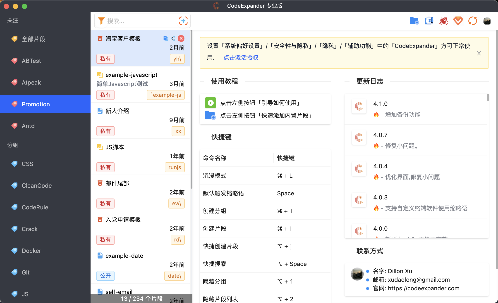
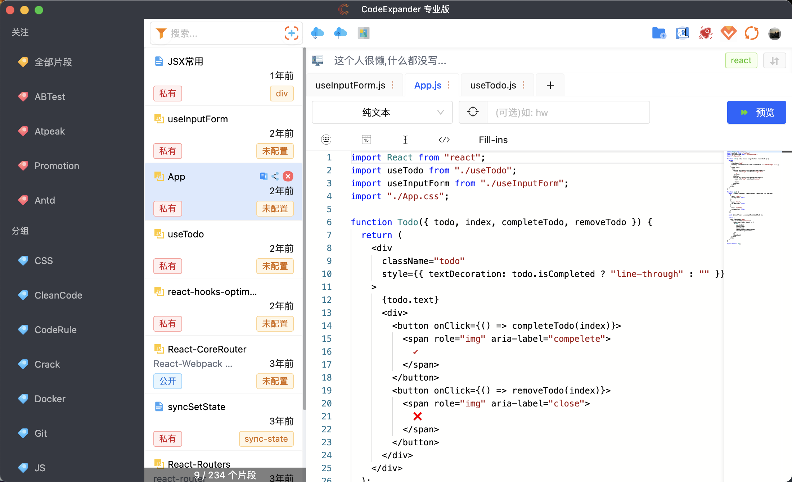
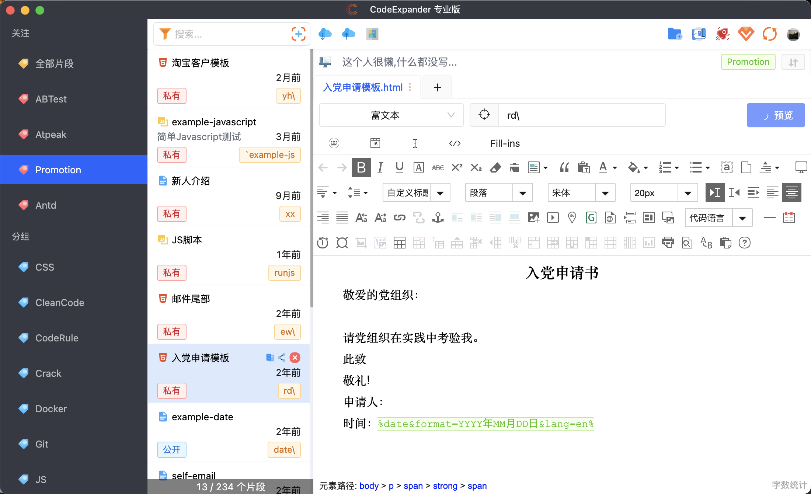
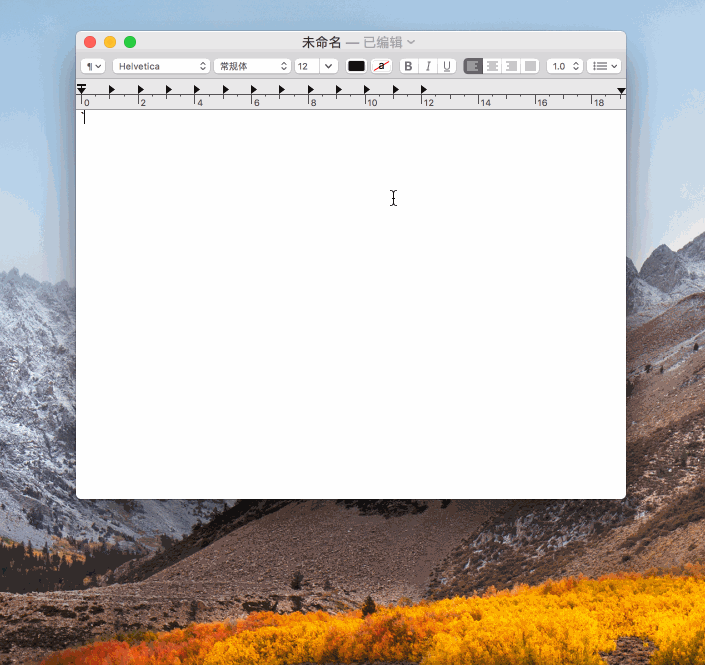
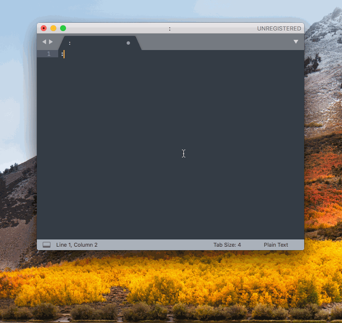
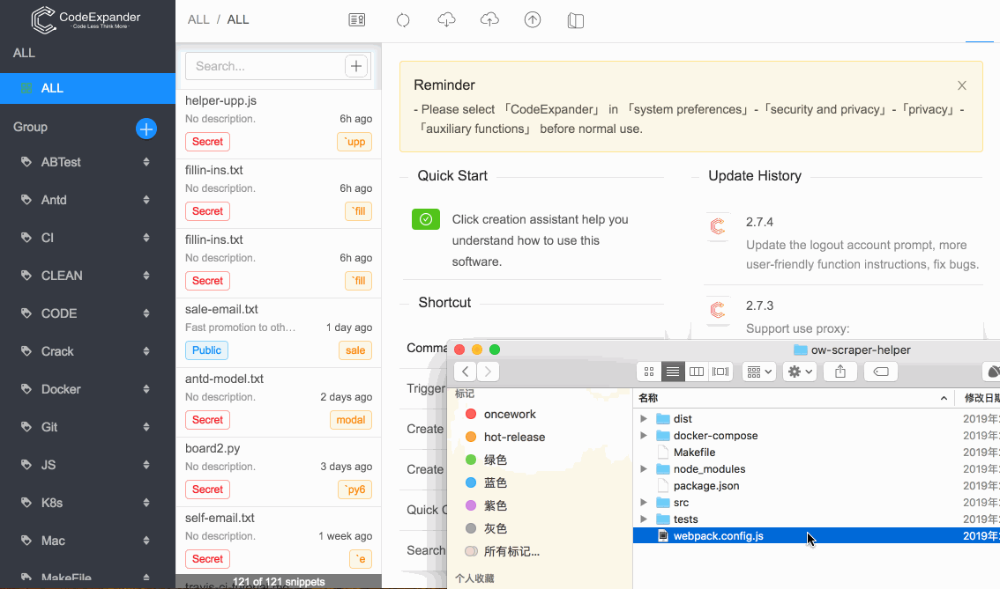
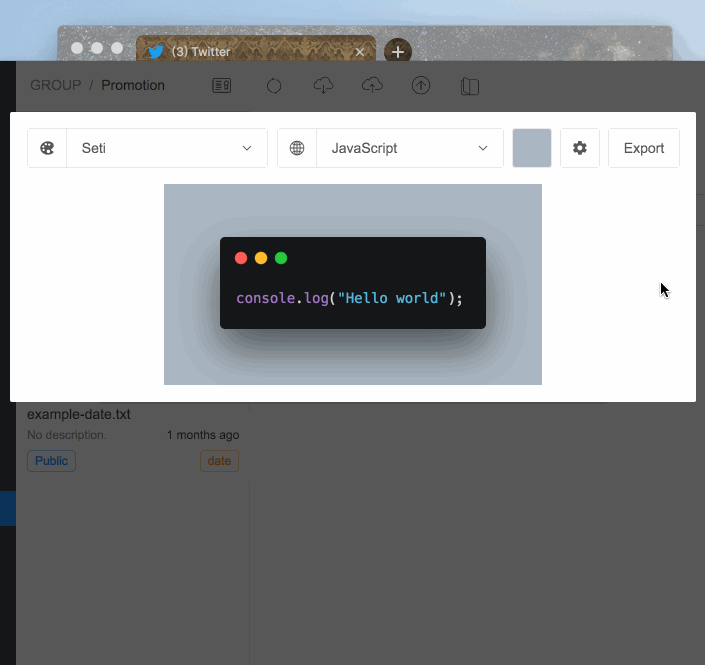

# CodeExpander

`CodeExpander` is a cross-platform cloud synchronization development tool for developers that includes input enhancement(`Text expander`), `code snippet management`. It saves and manages text or script snippets that require repeated input and can be expanded automatically by setting abbreviations.

All snippets can be synchronized to the clip management of `Localization`,` Github`, `码云` platform, with unlimited public / private clips, grouping, cloud synchronization, online editing, and sharing with others.

## **Document**

[Getting Started](https://codeexpander.com/en/views/introduce/basic-usage.html)

## **Download**

MacOS 10.14/10.13/10.12/10.11 \(Mojave, High Sierra, Sierra...\) **Or** Windows 7/8/10

[Click to Download](https://github.com/oncework/codeexpander/releases)

## **Pricing**

Most features are free and buy now for \$4.99 if you want to support the author

- [爱发卡](https://w.url.cn/s/AHRprNl)
- [Paddle](https://pay.paddle.com/checkout/540339)

Please contact me if you have any questions

## Features

### Smarter typing

Avoid typing the same sentence repeatedly, refusing to paste and copy starts with me. [How to create>>](https://codeexpander.com/en/views/advance/text-and-script.html)

> How it works: Detect keywords you enter (pre-set instructions) and replace them as you type.

### Custom scripts

Quickly run the script to get the processed results, and you can achieve any function you want.[How to create>>](https://codeexpander.com/en/views/advance/text-and-script.html)

### Create template

Support custom date, simulate keyboard macro, generate rich text template.[How to create>>](https://codeexpander.com/en/views/advance/fill-in.html)

### Create snippets

Quickly save existing code snippets and sync to another computer.

### Generate code picture

Easier to share your own style clips to others.

### Search bar

No memory required, fuzzy full text search results.[How to use>>](https://codeexpander.com/en/views/introduce/quick-browse.html)

All clips can be synchronized to the clip management of `Localization`,` Github`, `Code Cloud` platform, with unlimited public / private clips, grouping, cloud synchronization, online editing, and sharing with others.
## **Support**

[Product hunt support](https://www.producthunt.com/posts/oncework?utm_source=badge-featured&utm_medium=badge&utm_souce=badge-oncework)

