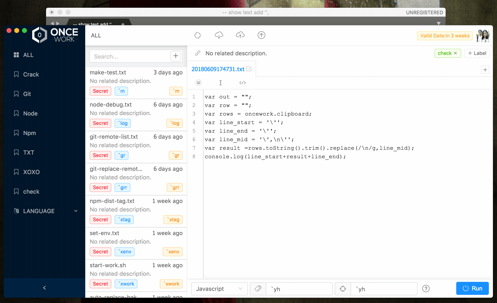
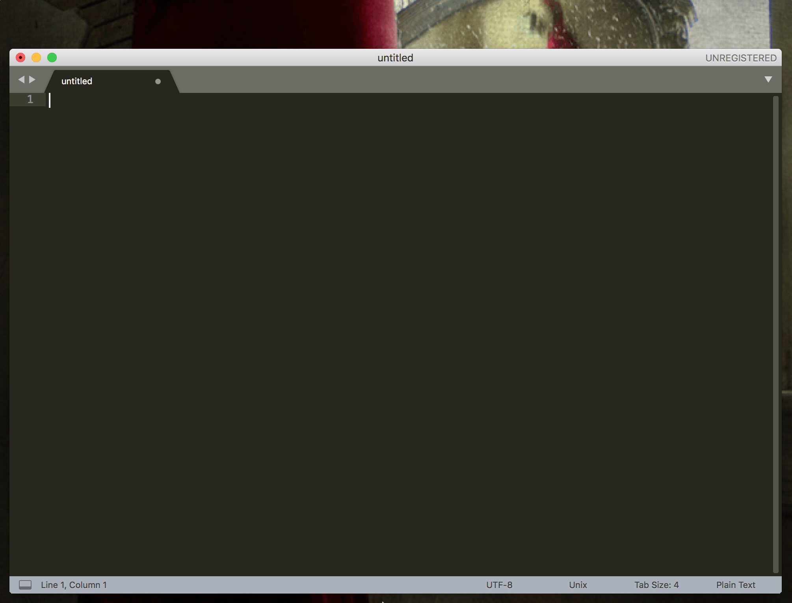

# Oncework

Oncework is an efficiency software like TextExpander or aText that combines github-gist. In short, it is a quick input tool for Mac/Win. It can save Content that needs to be typed repeatedly, and it can preset an Abbreviation, which will be automatically expanded the next time you need it.

## Contents

* [Features](features.md)
* [Installation](installation.md)
* [View](view.md)
* [Basic](basic.md)
* [Advanced](advanced.md)
* [Shortcut](shortcut.md)
* [FAQ](faq.md)

## Download

Latest version of MAC

> [https://github.com/oncework/oncework/releases/latest](https://github.com/oncework/oncework/releases/latest)

Latest version of Windows

> [https://github.com/oncework/oncework/releases/tag/1.1.7](https://github.com/oncework/oncework/releases/tag/1.1.7)

## Usage

Set values to replace

  
Search substitution - an Alfred - like use habit.

### Function Updates

* [ ] When bash shell/python is running, software notification is supported
* [x] Customize software shortcut key Settings
* [x] Supports keyboard command execution
* [ ] Create a Gist add file type
* [ ] White noise music background
* [x] A reference to the NPM library
* [ ] Dynamically generate UI components
* [x] Optimize the algorithm of Cursor
* [x] Internationalization of software language

