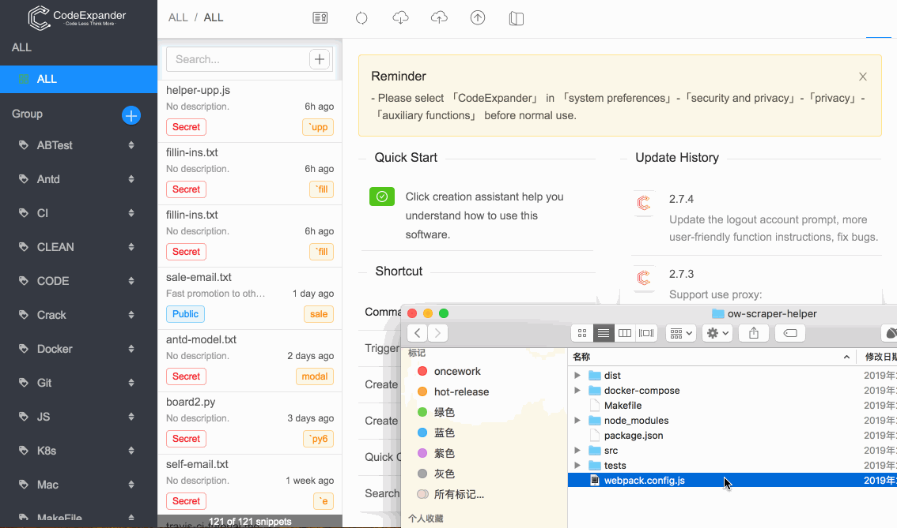
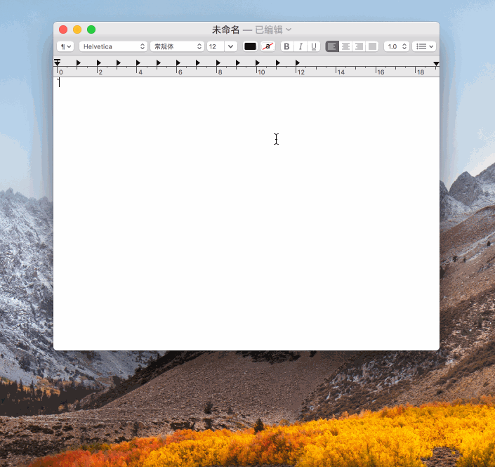

# CodeExpander

`CodeExpander` is a smart feature with TextExpander and embraces the GitHub Gist client. It saves and manages text or script snippets that require repeated input and can be expanded automatically by setting abbreviations.

## **Feature**

- Unlimited public/private snippets
- Unlimited snippets group
- Cloud synchronization, online editing and sharing support
- Instant instruction support
- Dynamic script snippet support
- Custom date, simulated keyboard macros, generated text template support
- Code highlighting, formatting, substitution support
- Generate custom theme snippet images(png/svg)
- Search snippet support
- Proxy
- Cross-platform support
- Hot update support
  ...

## **Document**

[Getting Started](https://once.work/introduce/basic-usage)

## **Download**

MacOS 10.14/10.13/10.12/10.11 \(Mojave, High Sierra, Sierra...\) **Or** Windows 7/8/10

[Click to Download](https://github.com/oncework/codeexpander/releases)

## **Pricing**
Most features are free and buy now for \$4.99 if you want to support the author

- [爱发卡](http://t.cn/EUl64FS)
- [Paddle](https://pay.paddle.com/checkout/540339)

## Common use cases

Quick Create

Dynamic script generation

Reply Mail

Custom code snippet

Search snippets

Create and share beautiful Snippets

## **Support**

[Product hunt support](https://www.producthunt.com/posts/oncework?utm_source=badge-featured&utm_medium=badge&utm_souce=badge-oncework)

