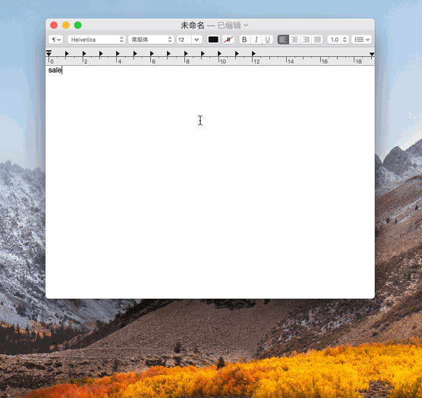
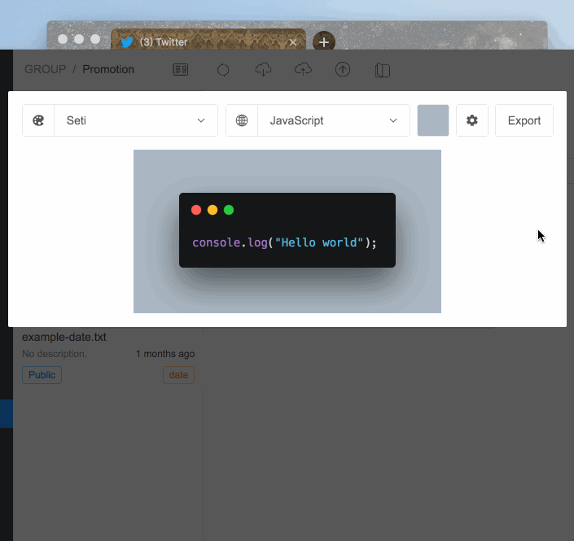

## **Feature**

- Unlimited public/private snippets
- Unlimited snippets group
- Markdown features(abbr、deflist、emoji、footnote...)
- Cloud synchronization, online editing and sharing
- Instant instruction
- Dynamic script snippet
- Custom date, simulated keyboard macros, generated text template
- Code highlighting, formatting, substitution...
- Generate custom theme snippet images(png/svg)
- Search snippet
- Proxy
- Cross-platform
- Hot update
  ...

## **Document**

[Getting Started](https://once.work/introduce/basic-usage)

## **Download**

MacOS 10.14/10.13/10.12/10.11 \(Mojave, High Sierra, Sierra...\) **Or** Windows 7/8/10

[Click to Download](https://github.com/oncework/codeexpander/releases)

## **Pricing**

Most features are free and buy now for \$4.99 if you want to support the author

- [爱发卡](https://w.url.cn/s/AHRprNl)
- [Paddle](https://pay.paddle.com/checkout/540339)

Please contact me if you have any questions

## Common use cases

Quick Create

Dynamic script generation

Reply Mail

Custom code snippet

Search snippets

Create and share beautiful Snippets

## **Support**

[Product hunt support](https://www.producthunt.com/posts/oncework?utm_source=badge-featured&utm_medium=badge&utm_souce=badge-oncework)

