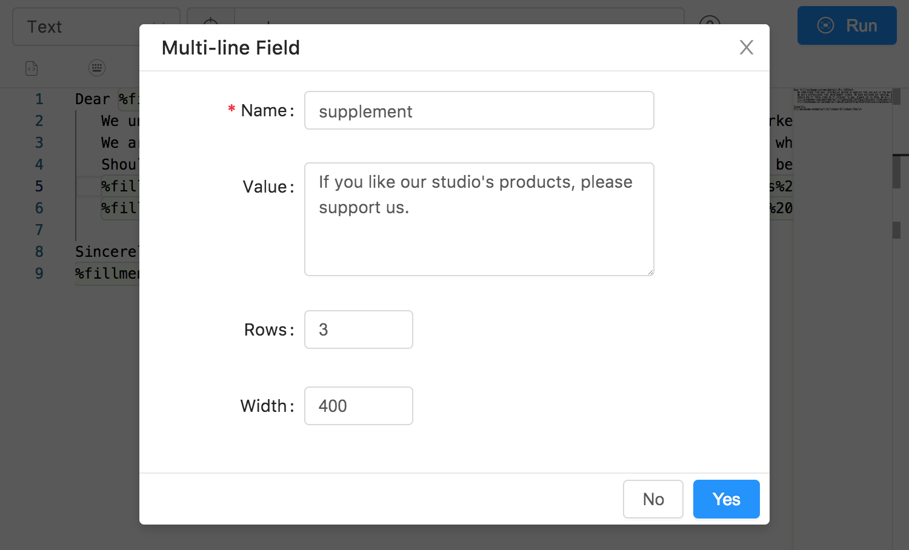

## Fill-In Tool

Simplify your email. Take sample email responses or sales queries and customize the areas you need. You have multiple jobs, use your email signature, and link to current social media!

- Sing-line Field

- Multi-line Field

- Optional Section

- Popup Menu

## Mixed Test Cases

- In the snippet format drop-down menu, choose `Text` as the format type.
- In the snippet field, you may enter:

<Gist id="3e01618ffeb53256ae8d13b5f120baf0"></Gist>
