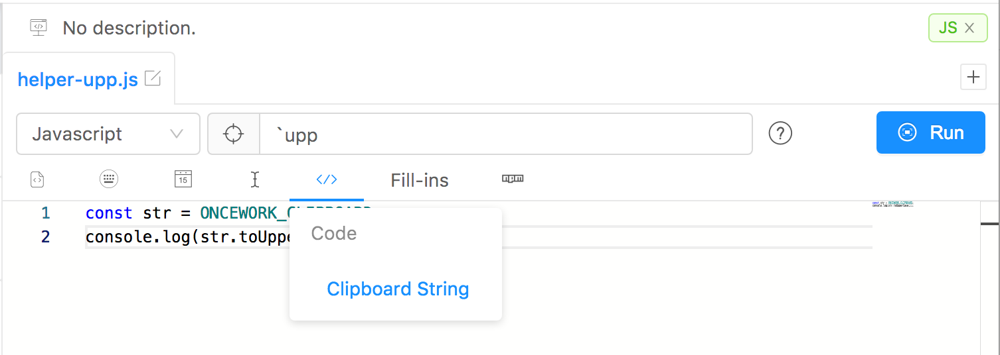

## Plain Text Snippets

As the name implies, `plain text` snippet insert unformatted text. In most cases, all you need is plain text.

- In the snippet format drop-down menu, choose `Text` as the format type.
- In the snippet field, you may enter:
  - Plain Text
  - [KeyBoard Component](keyboard.md)
  - [Calendar Component](calendar.md)
  - [Fill-In Component](fill-in.md)


## Script Snippets

Snippets are functional snippets provided to people with a certain amount of `coding power` or written by them and shared with others.

It has great flexibility to meet most `dynamic requirements`. However, the build environment depends on the native environment, so you need to install the associated build environment.

> Its built-in function: clipboard properties `CODEEXPANDER_CLIPBOARD`



## Javascript

For simple example:

- In the snippet format drop-down menu, choose `Javascript` as the format type.
- In the snippet field, enter such a javascript script

  ```javascript
  console.log("Hello world");
  ```


> `CodeExpander` captures the output of the `console` and returns it to the consumer, because it is an essential element of the entire javascript, otherwise it gets nothing.

## Shell

For simple example:

- In the snippet format drop-down menu, choose `Shell` as the format type.
- In the snippet field, enter such a shell script

  ```bash
  #!/bin/sh
  echo $CODEEXPANDER_CLIPBOARD
  ```

> `CodeExpander` captures the output of the `echo` and returns it to the consumer, because it is an essential element of the entire javascript, otherwise it gets nothing.

## Python

For simple example:

- In the snippet format drop-down menu, choose `Python` as the format type.
- In the snippet field, enter such a shell script

  ```python
  print(CODEEXPANDER_CLIPBOARD)
  ```

> `CodeExpander` captures the output of the `print` and returns it to the consumer, because it is an essential element of the entire javascript, otherwise it gets nothing.

## AppleScript

Same as above.
