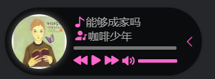

## Introduce <GitHubLink repo="vuepress-reco/vuepress-plugin-bgm-player/"/>


Bgm player plugin for vuepress-theme-reco or other vuepress theme.  

### Name

- **As plugin**: `@vuepress-reco/vuepress-plugin-bgm-player`
- **As component**: `BgMusic`（自动出现在页面中，无需添加额外代码）

## Option API

> 以下为插件注入时的参数。

### audios

- description: 播放列表
- type: `Array`
- default: 无默认值且必须配置
- example
  ```
  audios: [
    // 本地文件示例
    {
      name: '장가갈 수 있을까',
      artist: '咖啡少年',
      url: '/bgm/1.mp3',
      cover: '/bgm/1.jpg'
    },
    // 网络文件示例
    {
      name: '강남역 4번 출구',
      artist: 'Plastic / Fallin` Dild',
      url: 'https://assets.smallsunnyfox.com/music/2.mp3',
      cover: 'https://assets.smallsunnyfox.com/music/2.jpg'
    },
    {
      name: '用胳膊当枕头',
      artist: '최낙타',
      url: 'https://assets.smallsunnyfox.com/music/3.mp3',
      cover: 'https://assets.smallsunnyfox.com/music/3.jpg'
    }
  ]  
  ```

### position

- description: 播放器位置
- type: `Object`
- default
  ``` json
  { 
    left: '10px',
    bottom: '10px',
    'z-index': '999999'
  }
  ```

### shrinkMode

- description
  - PC端可以通过shrinkMode来指定缩小时缩为哪种模式
  - 移动端默认缩小为浮窗模式
- type: `String`
- default: `mini`
- accepted-values: `mini | float`

### floatPosition

- description: 指定浮窗模式浮动在哪一侧
- type: `String`
- default: `left`
- accepted-values: `left | right`

### floatStyle

- description: 浮窗的样式
- type: `Object`
- default:
  ```json
  { 
    bottom: '100px',
    'z-index': '999999'
  }
  ```

## About

- **兼容性**：vuepress-plugin-bgm-player是使用HTML5的Audio开发，故兼容性与Audio的兼容性相关
- 对于 `vuepress-theme-reco` 的 `dark` 模式的适配  
  
- **开发计划**
  - 自动播放
  - 移动端适配问题修复
  - 切换动画