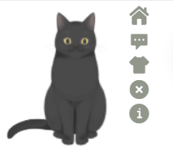

## Introduce <GitHubLink repo="vuepress-reco/vuepress-plugin-kan-ban-niang/"/>



kan-ban-niang plugin for vuepress-theme-reco or other vuepress theme.  

### Name

- **As plugin**: `@vuepress-reco/vuepress-plugin-kan-ban-niang`
- **As component**: `KanBanNiang`（自动出现在页面中，无需添加额外代码）

### Buttons

|按钮|作用|默认提示语|
|-|-|-|
|home|回到博客主页|心里的花，我想要带你回家。|
|message|显示主人寄语|'欢迎来到 ' + 您的站点名称（$site.title）|
|theme|更换模型主题|好吧，希望你能喜欢我的其他小伙伴。|
|close|关闭看板娘|你知道我喜欢吃什么吗？痴痴地望着你。|
|info|跳转插件github|想知道关于我的更多信息吗？|

## Option API

> 以下为插件注入时的参数。

**Attributes**

### theme

- description: 默认模型主题
- type: `Array`
- default: `['blackCat', 'whiteCat', 'haru1', 'haru2', 'haruto', 'koharu', 'izumi', 'shizuku', 'wanko', 'miku', 'z16']`
- accepted-values: 
  - theme仅包含一个值是默认为此主题并隐藏更换主题按钮
  - theme为多个值时初始化默认为第一个主题，点击更换主题按钮随机更换数组内的其他主题
  - 请注意主题名的大小写
  - 可选主题见最后

### clean
- description: 是否开启clean模式(隐藏所有按钮)
- type: `Boolean`
- default: `false`
- accepted-values: `true | false`

### messages

- description: 按钮提示语
- type: `Object`
- default:
  ```json
    {
      welcome: '欢迎来到 ' + 您的站点名称（$site.title）,
      home: '心里的花，我想要带你回家。',
      theme: '好吧，希望你能喜欢我的其他小伙伴。',
      close: '你知道我喜欢吃什么吗？痴痴地望着你。'
    }
  ```
- accepted-values: 见最后

### messageStyle

- description: 自定义消息框样式
- type: `Object`
- default: 
    ```json
    { 
      right: '68px', 
      bottom: '190px'
    }
    ```

### modelStyle

- description: 自定义模型样式
- type: `Object`
- default: 
    ```json
    { 
      right: '90px', 
      bottom: '-20px', 
      opacity: '0.9'
    }
    ```

### btnStyle

- description: 自定义按钮样式
- type: `Object`
- default: 
    ```json
    { 
      right: '90px', 
      bottom: '40px', 
    }
    ```

### width

- description: 模型宽度
- type: `Number`
- default: `150`

### height

- description: 模型高度
- type: `Number`
- default: `220`


## 可选主题


## About

- 参考插件: [@Qi](https://github.com/QiShaoXuan) https://github.com/QiShaoXuan/vuepress-plugin-cat  
- 模型库： [@Qi](https://github.com/QiShaoXuan) https://github.com/QiShaoXuan/live2DModel
- 模型加载失败时会自动隐藏
- 加载静态资源速度不稳定
- 想使用本插件之外的其他模型可以将插件下载到本地引入更换模型url

## Contributors

<Contributors user="vuepress-reco" repo="vuepress-plugin-kan-ban-niang"></Contributors>
