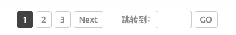

## Introduce <GitHubLink repo="vuepress-reco/vuepress-plugin-pagation/"/>

Pagation plugin for vuepress-theme-reco or other vuepress theme.

### Name

- **As plugin**: `@vuepress-reco/vuepress-plugin-pagation`
- **As component**: `Pagation`（主题开发时使用）

## Option API

### total

- description: 数据总数量
- type: `Number`
- default: `10`

### perPage

- description: 每页多少条
- type: `Number`
- default: `10`

### currentPage

- description: 当前是第几页
- type: `Number`
- default: `1`

### getCurrentPage

- description: 当前是第几页
- type: `Function`

## Contributors

<Contributors user="vuepress-reco" repo="vuepress-plugin-pagation"></Contributors>