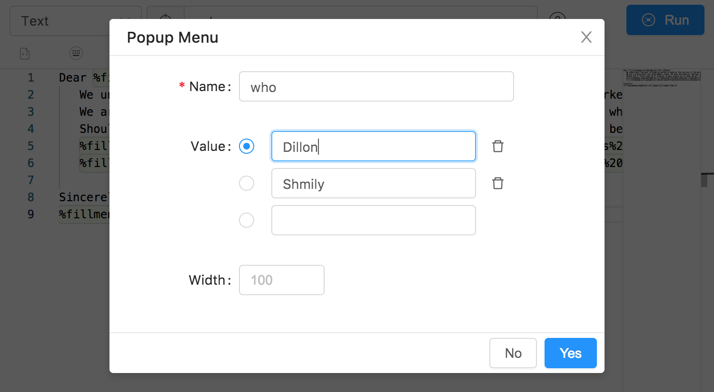

# Fill-In

## Fill-In 工具

简化您的电子邮件。获取示例电子邮件回复或销售查询，并自定义您需要的区域。如您有多个工作，使用您的电子邮件签名，并链接到当前的社交媒体！

- Sing-line Field

- Multi-line Field

- Optional Section

- Popup Menu

## 测试用例

- 在代码段格式下拉菜单中，选择`文本`作为格式类型。
- 在代码段字段中，您可以输入：

<Gist id="3e01618ffeb53256ae8d13b5f120baf0"></Gist>
