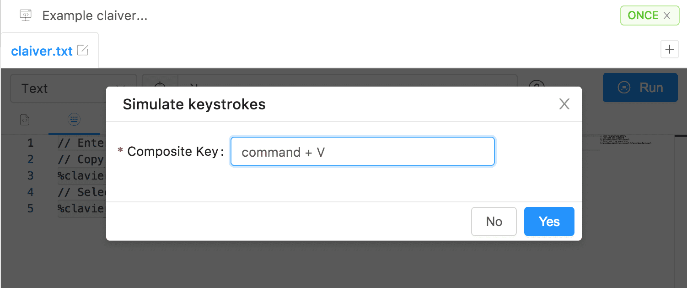

## KeyBoard 工具

键盘将模拟键盘操作，每个模拟键将跟随下一个模拟键。


- `Enter、Esc、Tab`
- `自定义复合键盘`




## 自定义复合键盘

举个简单的例子：

- 在代码段格式下拉菜单中，选择`文本`作为格式类型。
- 在代码段字段中，输入这样的`文本`

  ```text
  // Enter %clavier&key=Enter%
  // Copy from the clipboard
  %clavier&key=V&modifier=command%
  // Select and clear everything
  %clavier&key=A&modifier=command% %clavier&key=Backspace%
  ```
