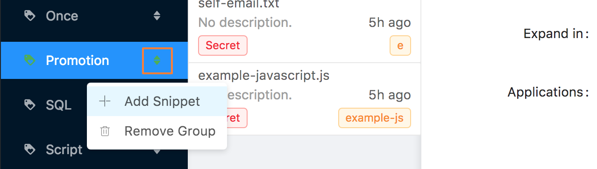

# 入门

## 设置您的帐户

1. 创建 [Github](https://github.com/join?source=experiment-header-dropdowns-home) 账号.
2. [下载](https://github.com/oncework/codeexpander/releases) 该应用. 

此时，您可以购买软件激活码或继续使用免费模式.

## 设置您的应用程序

请按照以下步骤学习如何使用该软件

### 安装

您可以参考此模块进行安装



### 登录`github`帐户

### 创建一个新分组

您可以使用 [快捷键](../support/reference/shortcut.md) `⌘ + T` 或触摸加号按钮，如下所示

### 创建一个新代码段

您可以使用 [快捷键](../support/reference/shortcut.md) `Alt + ]` 打开Create-Snippet窗口或触摸加号按钮，如下所示。

### 选择片段类型



#### 完成.

## 常问问题

#### 我可以在线编辑我的代码段吗？

`可以`. 只需点击 **链接** 按钮， 跳转到 `gist website`.

#### 我可以配置软件的首选项吗？

`可以`.

