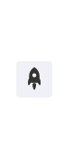

## Introduce <GitHubLink repo="vuepress-reco/vuepress-plugin-back-to-top/"/>



Back-to-top plugin for vuepress-theme-reco or other vuepress theme.

### Name

- **As plugin**: `@vuepress-reco/vuepress-plugin-back-to-top`
- **As component**: `BackToTop（自动出现在页面中，无需添加额外代码）`

## Option API

### icon

- description: 按钮中间的图标名字
- type: `String`
- default: `reco-up`
- accepted values: 主题内置的其他图标

### visibilityHeight

- description: 按钮出现时的最小滚动高度
- type: `Number`
- default: `400`

### customStyle

- description: 自定义按钮的样式
- type: `Object`
- default: 
  ```json
  {
    right:'1rem',
    bottom: '6rem',
    width: '2.5rem',
    height: '2.5rem',
    'border-radius': '.25rem',
    'line-height': '2.5rem',
    backgroundColor: 'rgba(231, 234, 241,.5)'
  }
  ```
## Contributors

<Contributors user="vuepress-reco" repo="vuepress-plugin-back-to-top"></Contributors>
