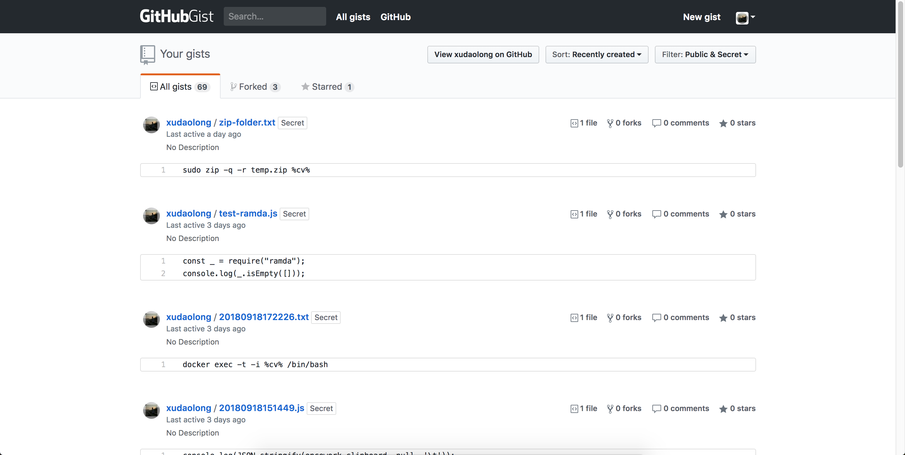

# FAQ

### Gist 是什么?

Gist 是一种与其他人共享代码片段和粘贴的简单方法。当您需要与同事或朋友共享示例代码或技术时，可以使用它。

当前版本依不赖于 github 帐户，网络。

### 为何开发该软件？

开发的初衷，毕业两年多，自己在编程开发的过程中，经常会遇到输入重复性的操作和命令。第一次接触到类似的软件的时候，感觉到这些软件确实能够大大减少开发时间，至少避免让自己的脑子花去记起那些命令。Code Less, Think More.

然而，我发现类似的软件一般都是国外制作，均有些不如意的地方：

- 跨平台同步问题
- 订阅的费用昂费
- 支持自定义新功能
- ...

所以，闲也闲着，就撸起本子 Coding ...

### 为何对软件进行收费？

- 软件部分功能都是免费的，像片段的增删改查同步的管理是免费的。收费的是为了正常的产品迭代，因为作者也需要大量时间来做研究、开发、修复，以及为软件提供支持。
- 我采用的是`买断制付费`，您只需要请我喝杯咖啡就能使用该软件的之前和之后的功能，另外因为我只是作为一名独立开发者，并不需要有像公司那般求生欲。这就足够了。
- 当然，最开心的是自己的产品能帮助到其他人。
