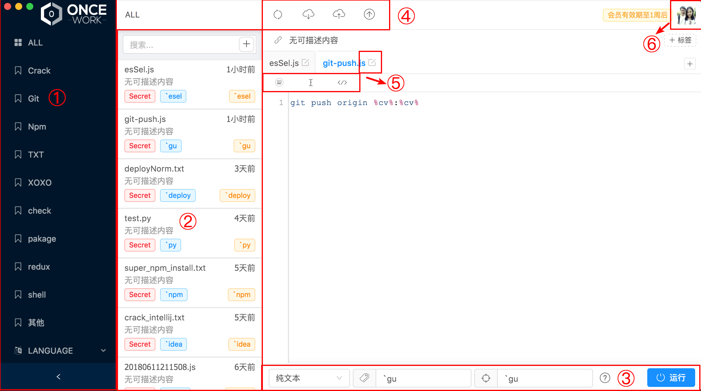

# Main

### Main screen

* ① List of tags
* ② The Gist list of tags corresponding to rows
  * Support for screening
  * Add new Gist
* ③ Parameter Settings for the parameters of the paintings
  * The running environment, Label, and acronym run, in turn, 
  * preview the Gist runtime state
* ④  Function
  * All synchronous
  * Update the opened Gist from the github-gist center
  * Open the Gist and upload it to github-gist
  * Software check and update
* ⑤ Text editing function
* ⑥ Personal setting function

