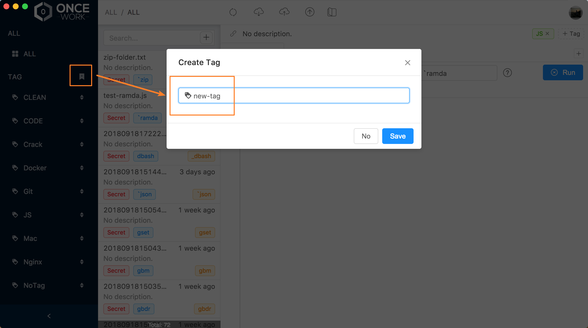
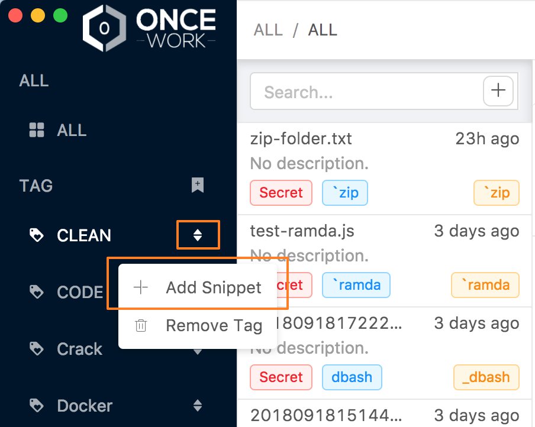
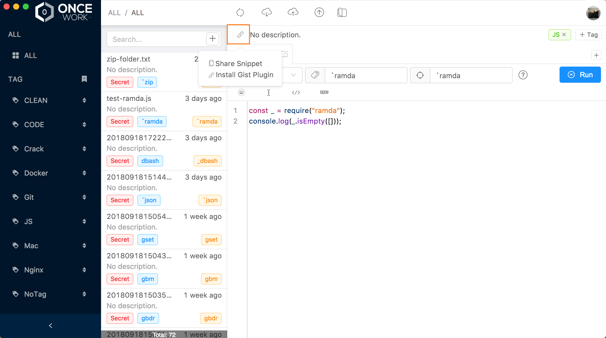

# Getting Started

#### How to create tag ?

Just touch the **TAG** flag and open window to create.

#### How to create snippet ?

You can use shortcut **Alt** + \] and open the Create-Snippet-window or touch the plus button as follow.

#### How do I see where my snippets are stored ？

Just click the **Link** icon and jump to the gist website.

#### How to set custom parameters ? 

You can set the hotkeys or more and more.

