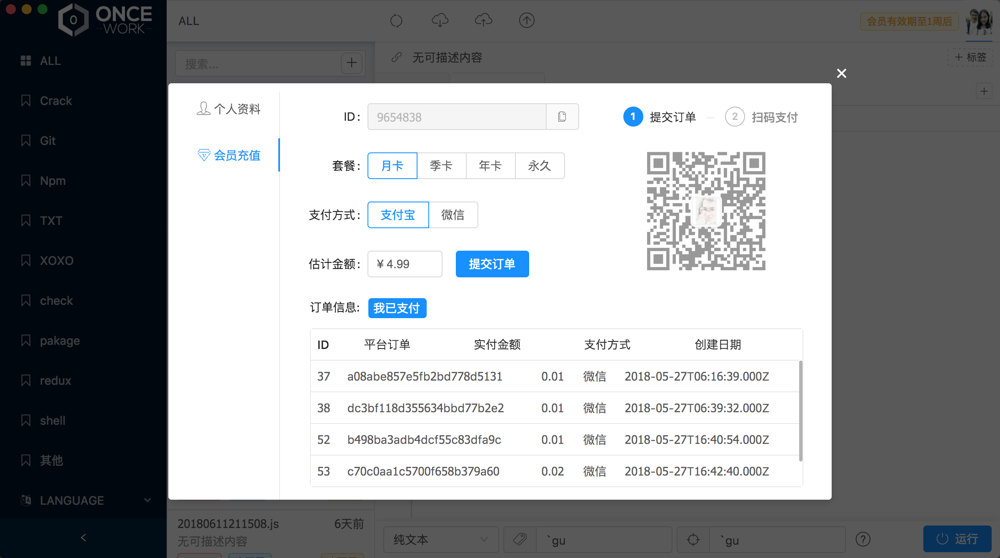

# 主界面

## 主界面

* ① 标签列表
* ② 对应标签的 Gist 列表
  * 支持筛选
  * 添加新 Gist
* ③ Gist 参数设置
  * 依次是 运行环境、Label、缩略词
  * 运行即为预览该 Gist 运行时状态
* ④ 依次功能
  * 全部同步
  * 从Github-Gist中心更新打开的Gist
  * 打开的Gist上传至Github-Gist
  * 软件检查更新
* ⑤ 文本编辑功能
* ⑥ 个人设置功能


 若遇到Bug，请告知.


## 会员界面

软件Gist管理功能免费，部分功能次数限额，但是重启软件可恢复体验功能。


&lt;二维码支付&gt;后记得点击&lt;我已支付&gt;更新用户状态


